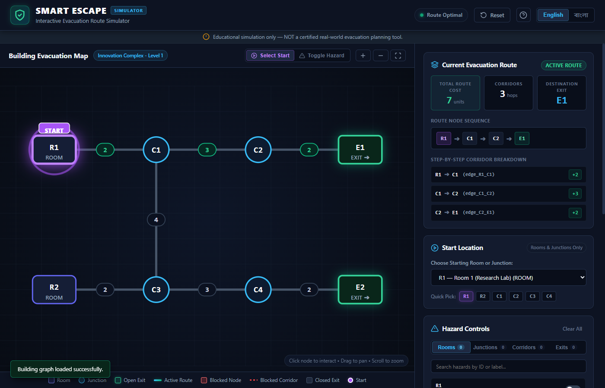
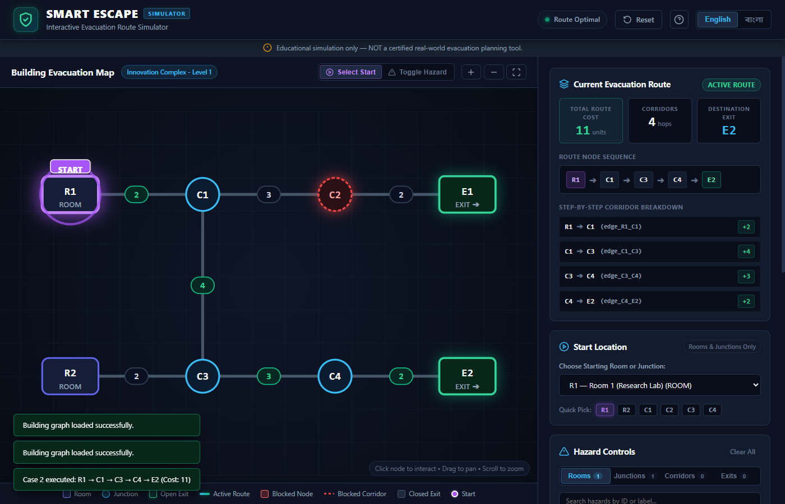
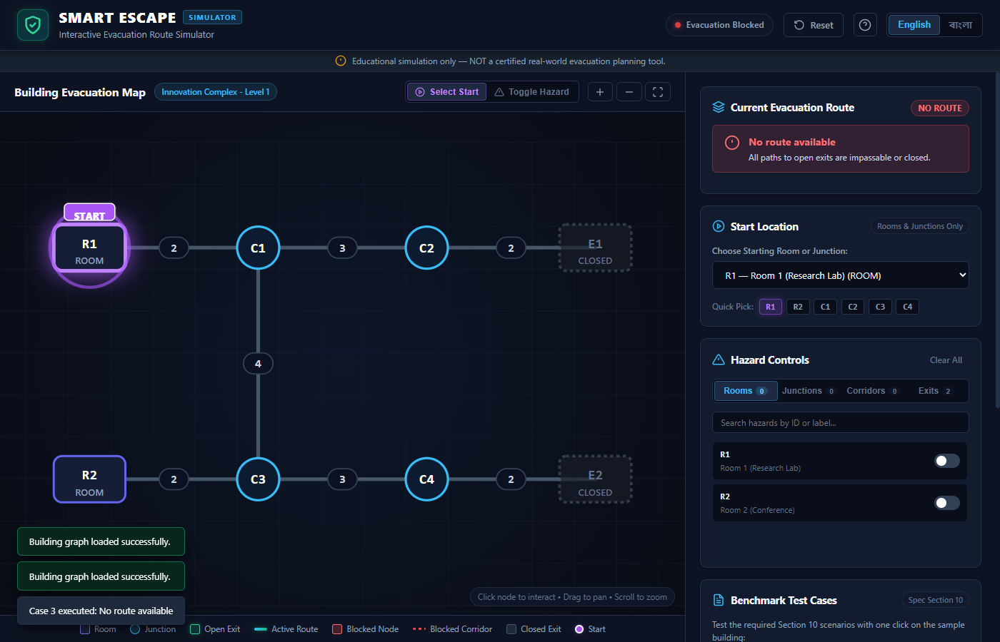
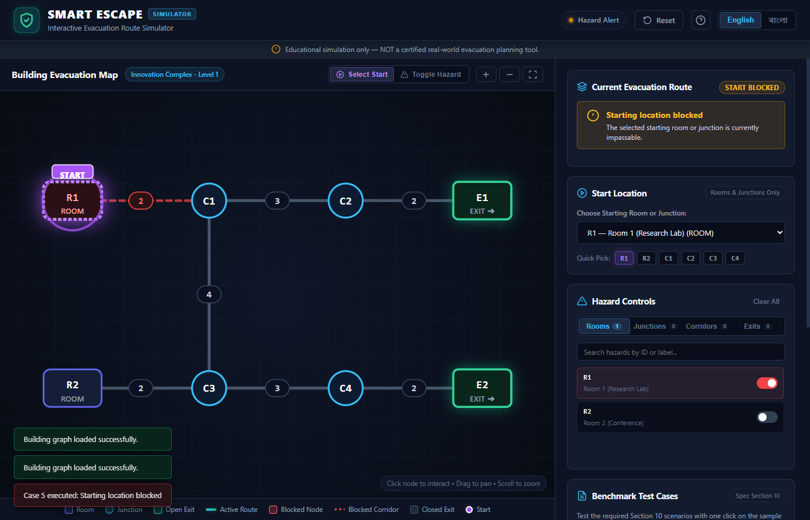
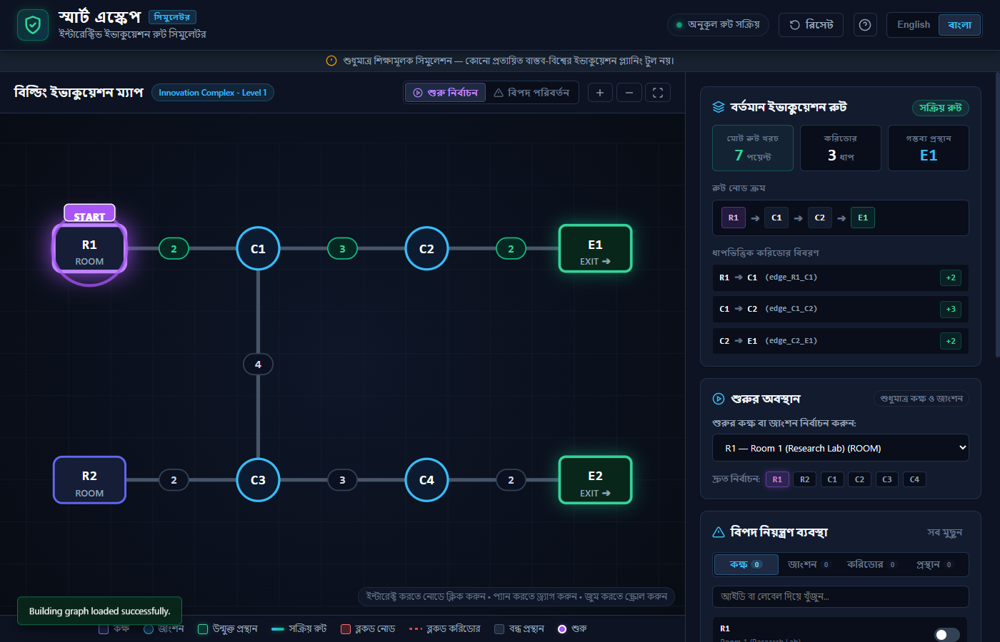
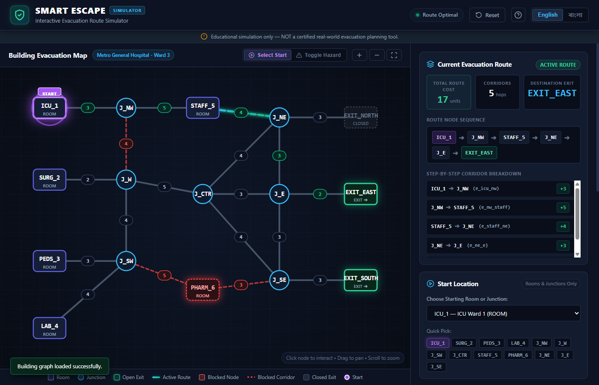

# SMART ESCAPE: Interactive Evacuation Route Simulator

> **Emergency Operations & Interactive Evacuation Route Simulation Dashboard**  
> *A frontend-only web application built with HTML5, CSS3, and Vanilla JavaScript (ES6+).*



---

## 📌 Project Overview

**SMART ESCAPE** is an educational, interactive building evacuation simulation designed to demonstrate graph-theoretic shortest-path computation under dynamic environmental hazards. Users can import arbitrary building floor plans as JSON graphs, designate starting locations (rooms or junctions), and observe real-time recalculation of the lowest-cost evacuation route to accessible emergency exits.

> **Disclaimer:** Educational simulation only — NOT a certified real-world evacuation planning tool.

---

## 🌟 Key Features

1. **Pure Frontend Architecture:**
   - 100% Vanilla JavaScript (ES6+), HTML5, and CSS3.
   - Zero external frontend frameworks (no React, Vue, Angular, or TypeScript).
   - Zero backend dependencies (no Node.js server, Express, databases, or cloud routing APIs).
   - Runs directly in any modern browser by opening `index.html`.

2. **Data-Driven Graph Engine & Strict Validation:**
   - Dynamically parses and renders arbitrary building layouts via `building.json`.
   - Comprehensive client-side validation against schema violations, duplicate IDs, self-loops, multi-edges, invalid node references, and non-positive edge costs.
   - Enforces competition limits (2 to 60 nodes, 1 to 150 edges).

3. **Mathematical Shortest-Path Algorithm (Dijkstra):**
   - Route costs are calculated **strictly by summing edge costs** ($W = \sum c_e$).
   - Never calculates costs based on visual pixel distances, coordinates, or hop counts.
   - Enforces deterministic exit and path tie-breaking:
     - Equal-cost exits break ties by lexicographical exit ID (`exitA < exitB`).
     - Equal-cost paths break ties by lexicographical node sequence.

4. **Dynamic Hazard Management:**
   - **Blocked Room/Junction:** Cannot be entered or traversed; immediately isolates all connected corridors.
   - **Blocked Corridor:** Only that corridor becomes impassable; endpoint nodes remain accessible via alternative routes.
   - **Closed Exit:** Prohibited from serving as a destination or an intermediate pass-through.
   - Instant visual update and route recalculation upon any hazard change (zero page reloads).

5. **Scalable Interactive SVG Building Map:**
   - Scalable vector graphics with automatic bounding-box calculation and responsive auto-fitting.
   - Layered rendering: background grid, corridors, active route glow, cost badges, nodes, and start beacons.
   - Interactive Pan & Zoom via mouse wheel, drag-to-pan, and dedicated toolbar controls (+, −, Fit).
   - Dual interaction modes: **Select Start** and **Toggle Hazard**.

6. **Bilingual Localization (English & বাংলা):**
   - Instant language switching between English and Bangla.
   - Translates all headers, buttons, cards, failure banners, status pills, metrics, test descriptions, and documentation.

7. **One-Click Benchmark Test Suite:**
   - Built-in runner for all 5 required Section 10 competition benchmark scenarios.

---

## 🚀 How to Run

Because this project is built exclusively with standard web technologies and contains zero build steps, you can run it immediately using any of the following methods:

### Method 1: Direct File Launch (No server required)
Simply double-click `index.html` or open it with your browser:
```bash
# Windows
start index.html
```
The application includes self-contained fallbacks for offline environments.

### Method 2: Local HTTP Server (Optional)
If you prefer running through a local web server:
```bash
# Using Python 3
python -m http.server 8000

# Or using Node.js
npx serve .
```
Then navigate to `http://localhost:8000` in your web browser.

---

## 📂 How to Import `building.json`

1. Locate the **Building Data Import** card in the right sidebar.
2. Either:
   - **Drag and drop** your `building.json` file directly onto the designated dropzone, OR
   - Click the dropzone to browse and select the file from your local disk.
   - Or select a preset dataset from the dropdown (`Innovation Complex` or `Metro General Hospital`).
3. If the file is valid, the graph will immediately render, the start location will be populated, and the optimal route will be calculated.
4. If the file is malformed or violates schema constraints, a detailed red error banner will indicate the exact validation failure without crashing the application.

---

## 🧮 Routing Algorithm Explanation

Smart Escape uses an adapted implementation of **Dijkstra's Shortest Path Algorithm** operating on an undirected, weighted graph $G = (V, E)$.

### Mathematical Formulation:
- Let $V$ be the set of nodes (rooms, junctions, exits).
- Let $E$ be the set of corridors, each with positive weight $c(e) > 0$.
- Let $B_V \subset V$ be the set of currently blocked nodes.
- Let $B_E \subset E$ be the set of currently blocked corridors.
- Let $C_X \subset V_{\text{exit}}$ be the set of closed exits.

### Usability Filter:
An edge $e = (u, v)$ is considered **usable** if and only if:
$$e \notin B_E \quad \land \quad u \notin B_V \quad \land \quad v \notin B_V \quad \land \quad u \notin C_X \quad \land \quad v \notin C_X$$

### Deterministic Tie-Breaking Logic:
When relaxing edge $(u, v)$ with candidate cost $C_{\text{cand}} = \text{dist}[u] + c(u, v)$ and candidate node sequence $P_{\text{cand}} = P[u] \cup \{v\}$:
1. If $C_{\text{cand}} < \text{dist}[v]$: update $\text{dist}[v] \leftarrow C_{\text{cand}}$ and $P[v] \leftarrow P_{\text{cand}}$.
2. If $C_{\text{cand}} == \text{dist}[v]$: compare node sequences $P_{\text{cand}}$ and $P[v]$ lexicographically:
   $$\text{comparePath}(P_{\text{cand}}, P[v]) < 0 \implies P[v] \leftarrow P_{\text{cand}}$$

### Destination Exit Selection:
Among all open exits $E_i \in (V_{\text{exit}} \setminus C_X)$ that are reachable ($\text{dist}[E_i] < \infty$):
1. Select the exit with minimum $\text{dist}[E_i]$.
2. If $\text{dist}[E_a] == \text{dist}[E_b]$, select $\min(E_a.\text{id}, E_b.\text{id})$ via lexicographical string comparison.

---

## 📋 Supported JSON Schema

```json
{
  "building": {
    "name": "Building Display Name",
    "description": "Optional description"
  },
  "nodes": [
    {
      "id": "R1",
      "label": "Room 1 (Research Lab)",
      "type": "room",
      "x": 100,
      "y": 140
    },
    {
      "id": "C1",
      "label": "Junction C1",
      "type": "junction",
      "x": 260,
      "y": 140
    },
    {
      "id": "E1",
      "label": "Exit 1",
      "type": "exit",
      "x": 580,
      "y": 140
    }
  ],
  "edges": [
    {
      "id": "edge_R1_C1",
      "from": "R1",
      "to": "C1",
      "cost": 2
    }
  ],
  "initial_state": {
    "blocked_nodes": [],
    "blocked_edges": [],
    "closed_exits": []
  }
}
```

### Schema Constraints & Validation Rules:
- **Node Count:** 2 to 60 nodes inclusive.
- **Edge Count:** 1 to 150 undirected edges inclusive.
- **Node Types:** Allowed values are `"room"`, `"junction"`, and `"exit"`.
- **Node IDs:** Case-sensitive, non-empty, unique strings.
- **Edge IDs:** Case-sensitive, non-empty, unique strings.
- **Edge Endpoints:** `from` and `to` must exist in `nodes`. Self-loops (`from === to`) and multi-edges (repeated undirected pairs) are strictly prohibited.
- **Edge Costs:** Must be positive finite numbers ($c > 0$).
- **Initial State:** All IDs in `blocked_nodes`, `blocked_edges`, and `closed_exits` must exist in the respective definitions.

---

## 🧪 Benchmark Test Cases (Section 10 Verification)

The application includes built-in one-click test runners for all 5 scenarios from the competition specification:

| Case | Scenario Action | Expected Route | Expected Cost | Status Display |
| :---: | :--- | :--- | :---: | :---: |
| **Case 1** | Select `R1` (baseline) | `R1 → C1 → C2 → E1` | **7** | `Active Route` |
| **Case 2** | Select `R1` and block `C2` | `R1 → C1 → C3 → C4 → E2` | **11** | `Active Route` |
| **Case 3** | Select `R1` and close `E1`, `E2` | *No route* | — | `No route available` |
| **Case 4** | Select `R2` (baseline) | `R2 → C3 → C4 → E2` | **7** | `Active Route` |
| **Case 5** | Select `R1` and block `R1` | *Start blocked* | — | `Starting location blocked` |

Automated unit test execution:
```bash
node tests/test_engine.js
```

---

## 📸 Screenshots

| Baseline Optimal Route (Case 1) | Dynamic Rerouting Around Hazard (Case 2) |
| :---: | :---: |
|  |  |

| No Route Available (Case 3) | Starting Location Blocked (Case 5) |
| :---: | :---: |
|  |  |

| Authentic Bangla Interface (বাংলা) | Multi-Corridor Hospital Complex (16 Nodes) |
| :---: | :---: |
|  |  |

---

## 🎁 Bonus Features Implemented

1. **Interactive SVG Pan & Zoom Engine:**
   - Smooth mouse-wheel zooming centered at cursor.
   - Click-and-drag panning across large floor plans.
   - Dedicated toolbar buttons: Zoom In (+), Zoom Out (−), and Auto-Fit.
2. **Interactive On-Map Hazard Toggling:**
   - Nodes and corridors can be toggled directly by clicking on them or right-clicking on the map.
3. **Preset Dataset Switcher:**
   - Instantly switch between the Section 10 Benchmark Building and a complex 16-node Metro Hospital layout.
4. **Current Graph State Exporter:**
   - One-click export button generating a valid JSON file containing current building geometry and active hazard modifications.
5. **Blueprint Grid & Architectural Aesthetic:**
   - Subtle background grid lines, neon path flow animations, and glow drop-shadow filters.
6. **URL Deep-Linking:**
   - Direct scenario links via URL parameters: `?case=2`, `?lang=bn`, `?dataset=hospital`.

---

## ⚠️ Known Issues / Limitations

- Coordinate ranges: Nodes with extreme coordinates (e.g. negative or > 10,000) are automatically framed by SVG `viewBox`, but optimal visual clarity is achieved when coordinates fall in standard pixel ranges (0–1000).
- Browser Print / PDF: When printing floor plans, SVG background grid lines may require enabling "Background graphics" in browser print settings.

---

## 🤖 AI Tools & Development Disclosures

- **AI Tools Used:** Google Gemini 3.8 Flash (High) via Antigravity Agentic Assistant.
- **Most Useful AI Prompt:**
  > *"Implement Dijkstra's shortest-path algorithm in vanilla JavaScript for an undirected graph with exact edge-cost summation only, strictly excluding blocked nodes, corridors connected to blocked nodes, blocked corridors, and closed exits. Enforce deterministic tie-breaking: if two reachable open exits have equal minimum total cost, choose the lexicographically smaller exit ID; if two paths to the same exit have equal cost, choose the lexicographically smaller sequence of node IDs."*

---

## 🌐 Deployment & Repository

- **Live Deployment:** [https://smart-escape-simulator.vercel.app](https://smart-escape-simulator.vercel.app) *(Placeholder)*
- **GitHub Repository:** [https://github.com/hbrajon890/smart-escape](https://github.com/hbrajon890/smart-escape) *(Placeholder)*

---

## 📄 License

This project is licensed under the terms of the [MIT License](LICENSE).